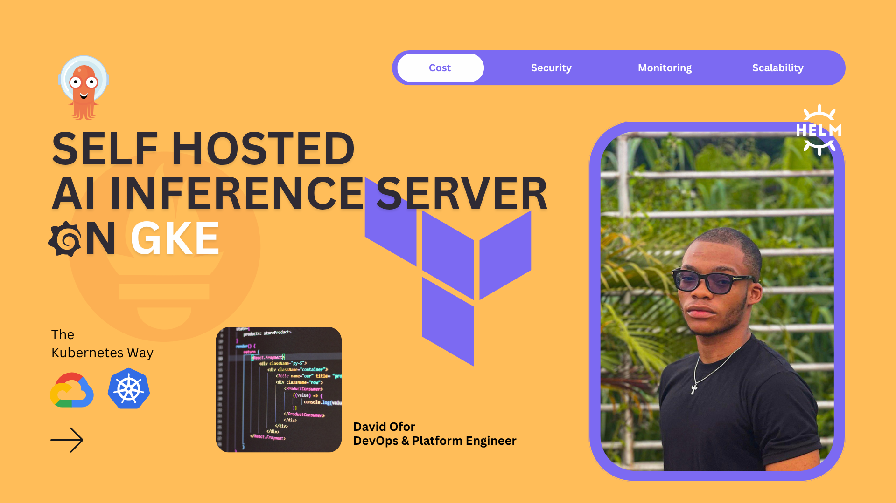
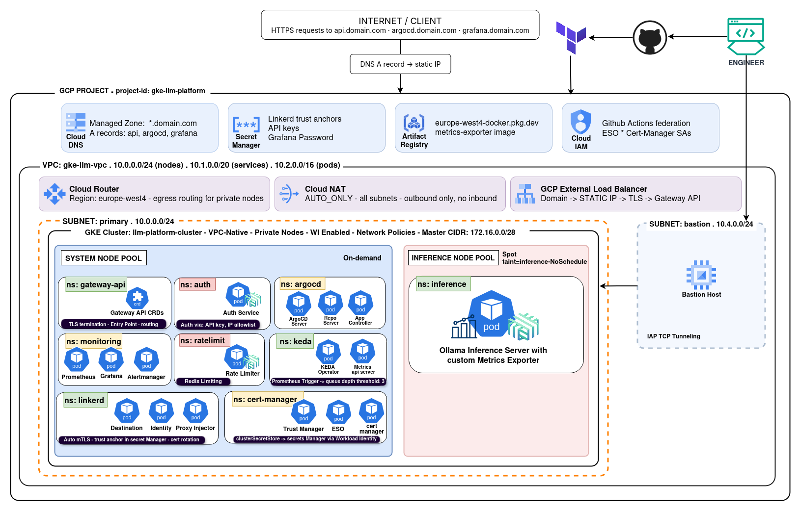

<div align="center">

# GKE LLM Inference Platform

[](https://github.com/Ofor-David/gke-llm-platform/actions)
[](https://kubernetes.io/)
[](https://www.terraform.io/)
[](https://opensource.org/licenses/MIT)

A production-grade, self-hosted AI coding assistant platform built on Google Kubernetes Engine. It serves the Qwen2.5-coder 1.5B language model via Ollama, exposing a secure, rate-limited, observable REST API over the public internet.

<div align="center">
  
</div>
<br/>

**Engineering Case Study:** Read the full story behind this architecture: [The GKE AI Platform That Keeps Your Code Yours](https://www.notion.so/Engineering-Case-Study-The-GKE-AI-Platform-That-Keeps-Your-Code-Yours-29b147aa1ff7805e9eadc6f66d4398bb?source=copy_link)

</div>

## Table of Contents

- [Why This Exists](#-why-this-exists)
- [Who Uses It](#-who-uses-it)
- [Tech Stack](#️-tech-stack)
- [Request Flow](#-request-flow)
- [Architecture](#️-architecture)
- [Security (Defence in Depth)](#️-security-defence-in-depth)
- [Autoscaling](#-autoscaling)
- [Observability](#-observability)
- [What's Implemented](#-whats-implemented)
- [Directory Structure](#-directory-structure)
- [Deployment](#-deployment)

## Why This Exists

Companies that write proprietary software face a dilemma with AI coding tools: they're productive but require sending source code to third-party APIs. This platform keeps your code within your own infrastructure, satisfies GDPR requirements by keeping data in the EU, and gives your team full control over model selection, access, cost, and observability.

## Who Uses It

- **Developers**: send code prompts from editors, CLI tools, or internal tooling
- **CI/CD pipelines**: automated code review or documentation generation
- **Platform team**: manages access, monitors usage, controls cost

## Tech Stack

<div align="center">
  
  
  
  <br/>
  
  
  
  <br/>
  
  
  
</div>

## Request Flow

Every API request flows through the following pipeline:

1. **Gateway**: GCP L7 Global Load Balancer with TLS via Let's Encrypt.
2. **Auth Service**: validates API keys, enforces IP allowlist
3. **Rate Limiter**: 10 requests/minute per key using Redis
4. **Metrics Exporter (Ollama Proxy)**: Python reverse proxy intercepting requests to extract token counts and durations, exposes to Prometheus
5. **Ollama**: serves Qwen2.5-coder 1.5B on CPU

## Architecture

### High Level Architecture



### Infrastructure

- **GCP Region**: europe-west4 (Amsterdam): GDPR compliance, low latency for Western Europe
- **Infrastructure as Code**: Terraform with remote state in GCS.
- **GKE Cluster**: Private cluster with two node pools
  - System pool: for platform services (ArgoCD, Prometheus, cert-manager, etc.)
  - Inference pool: Spot instances for Ollama (60-91% discount). Minimum 1 node maintained (warm node) to avoid 5-6 minute cold start.
- **Networking**: VPC with subnets for GKE and bastion, Cloud NAT for egress, Cloud DNS with DNSSEC.
- **Bastion**: Jump host for private cluster access via IAP tunneling

### Application Services

- **auth-service**: FastAPI, validates API keys from GCP Secret Manager, enforces IP allowlist
- **rate-limiter**: FastAPI + Redis, sliding window per-client rate limiting
- **metrics-exporter**: Python reverse proxy, extracts LLM metrics from Ollama responses
- **ollama**: Runs Qwen2.5-coder 1.5B, model weights on Regional SSD PVC

## Security (Defence in Depth)

Eight independent layers: each assumes the ones above may be compromised:

1. **Network perimeter**: only ports 80/443 exposed, GCP health checks whitelisted, GKE control plane via master authorized networks only
2. **TLS termination**: Let's Encrypt via DNS-01 challenge (domain proven via Cloud DNS TXT record), cert-manager handles auto-renewal
3. **Authentication**: API keys stored in GCP Secret Manager, synced via External Secrets Operator using Workload Identity (no static credentials)
4. **IP allowlist**: valid API keys rejected from unexpected IPs: stolen keys useless without network access
5. **Rate limiting**: 10 req/min per key prevents cost abuse from compromised keys or runaway scripts
6. **Service mesh mTLS**: Linkerd auto-injects sidecars at namespace level, all pod-to-pod traffic encrypted and mutually authenticated
7. **Network policies**: inference namespace defaults to deny, explicit allow for rate-limiter to metrics-exporter and Prometheus to metrics-exporter

## Autoscaling

- **KEDA** scales Ollama pods based on custom Prometheus metric `ollama_queue_depth`: adds second pod when queue exceeds 3 concurrent requests
- **Node pool** scales from 1 to 2 nodes to accommodate new pods
- **Scale to zero** during inactivity: platform team keeps one warm node to avoid 5-6 minute cold start
- Inference node pool uses spot instances: if reclaimed, GKE automatically replaces and pod reschedules

## Observability

- **kube-prometheus-stack**: Prometheus, Grafana, Alertmanager, node-exporter, kube-state-metrics (v82.1.0)
- **Grafana Dashboards**: Three custom dashboards are implemented:
  - _Cluster Overview_: Node CPU, memory, and pod health.
  - _Inference Metrics_: Request rate, p50/p95/p99 latency, error rate, and queue depth.
  - _LLM-Specific_: Tokens per second, prompt eval duration, generation duration, model load status, and estimated cost per hour (Prometheus recording rules × GCP instance pricing).
- **Metrics exporter sidecar**: Intercepts every Ollama request/response, extracts:
  - Token counts (prompt, completion, total)
  - Durations (prompt eval, generation)
  - Queue depth for KEDA scaling

## What's Implemented

- Terraform modules for VPC, GKE, node pools, Cloud DNS, Artifact Registry, IAM, bastion
- Kubernetes namespaces, Helm charts for auth-service, rate-limiter, metrics-exporter, and Ollama
- Linkerd service mesh (2026.2.1 edge), Linkerd viz for debugging
- cert-manager with Let's Encrypt
- External Secrets Operator with GCP Secret Manager and Workload Identity
- KEDA autoscaling based on queue depth
- kube-prometheus-stack deployment (Prometheus, Grafana, Alertmanager)
- Rate Limiter Service: FastAPI + Redis sliding window, 10 req/min per key, 429 with Retry-After
- Metrics Exporter: Prometheus metrics sidecar proxy for Ollama (tokens, latency, queue depth, cost)
- CI/CD Pipeline: GitHub Actions builds on commit, pushes to Artifact Registry. Uses GCP Workload Identity Federation (no static credentials in GitHub).
- Network policies for pod communication control
- ArgoCD Deployment with 17 GitOps applications, sync waves for ordered deployment

### Required GitHub Repository Secrets

Configure these secrets in your GitHub repository settings (`Settings to Secrets and variables to Actions`):

| Secret             | Description                                     |
| ------------------ | ----------------------------------------------- |
| `PROJECT_ID`       | GCP project ID                                  |
| `REGION`           | GCP region (e.g., `europe-west4`)               |
| `WI_PROVIDER_NAME` | Workload Identity provider name                 |
| `SERVICE_ACCOUNT`  | GCP service account email for workload identity |

## Directory Structure

```text
llm-platform/
├── .github/workflows/    # GitHub Actions CI/CD pipelines
├── terraform/            # GCP infrastructure as code (VPC, GKE, DNS, Artifact Registry)
│   └── README.md         # Terraform deployment guide
├── k8s/                  # Kubernetes manifests and Helm charts
│   ├── charts/           # Auth service, rate-limiter, metrics-exporter, and Ollama Helm charts
│   ├── values/           # Helm values for releases
│   ├── platform/         # Platform components (cert-manager, gateway-api, secrets, network-policies)
│   ├── argocd/           # ArgoCD applications for GitOps deployment
│   └── docs/             # Architecture, security, troubleshooting docs
└── services/             # Application source code
    ├── auth/             # FastAPI authentication service
    ├── rate-limiter/     # FastAPI + Redis sliding window rate limiter
    └── metrics-exporter/ # Prometheus metrics sidecar
```

## Deployment

### Prerequisites & Configuration

Before deploying, you must customize several project-specific identifiers in the codebase to match your GCP environment and domain configuration.

#### 1. GCP Project ID

Replace all instances of the placeholder `project-id` with your actual GCP Project ID in the following Kubernetes manifests and Helm values (note: terraform directory replacements are omitted here):

- **Kubernetes Manifests:**
  - `k8s/platform/cert-manager/llm-platform-clusterIssuer.yaml` (Line 14)
  - `k8s/platform/secrets/secret-store.yaml` (Lines 7, 18)
  - `k8s/values/cert-manager.yaml` (Line 223)
- **Helm Chart Values:**
  - `k8s/charts/auth-service/values.yaml` (Line 2)
  - `k8s/charts/rate-limiter/values.yaml` (Line 2)
  - `k8s/charts/ollama/values.yaml` (Lines 2, 19)

#### 2. Domain Name

Replace all instances of `your-domain.com` with your custom domain name in the following files:

- `k8s/platform/cert-manager/llm-platform-certificate.yaml` (Lines 12, 13, 14)
- `k8s/platform/gateway-api/routes.yaml` (Lines 12, 35, 58, 80, 81, 82)
- `k8s/values/argocd.yaml` (Line 46)

#### 3. GCP Service Accounts

Workload identity relies on matching KSA (Kubernetes Service Accounts) to GSA (GCP Service Accounts). When updating your Project ID, double-check that the resulting GSA emails match what you have provisioned:

- `secrets-sa@<YOUR-PROJECT-ID>.iam.gserviceaccount.com` in `k8s/platform/secrets/secret-store.yaml` (Line 7)
- `cert-manager-dns@<YOUR-PROJECT-ID>.iam.gserviceaccount.com` in `k8s/values/cert-manager.yaml` (Line 223)

See [terraform/README.md](./terraform/README.md) for infrastructure setup.

See [k8s/README.md](./k8s/README.md) for Kubernetes deployment and details on the ArgoCD sync waves.

**Warning on Secrets Synchronization:** Before External Secrets Operator (ESO) can sync secrets from GCP Secret Manager, the initial Kubernetes Secret mapping to the GCP Service Account (used by ESO) must be created manually using the `gcloud` CLI or the GCP console.
